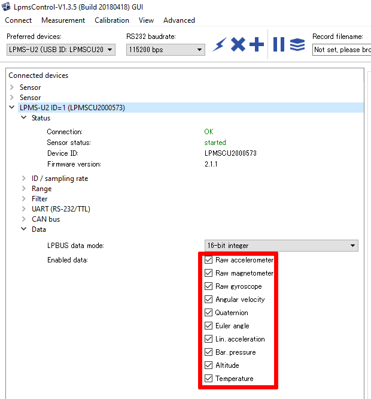

####################################
Sensor Configuration and Data Output
####################################

Overview
========
This section gives you an overview of the configuration options and data output of your sensor. For more detailed
and sensor-specfic explanations please see the documentation for the respective sensors. Furthermore, a detailed description
of the orientation sensor fusion and how to optimize it for your application case can be found there.

Data Output Settings
====================
Will all sensors models, the data which is transmitted can be selected individually to save bandwith and improve the
latency of the data transfer. Therefore, you need to ensure the data item you want to read out is enabled for output.
There are two ways to enable or disable the output of a data item.

**1. Use the graphical user interface tools LPMS-Control and IG1-Control**

You can download theses tools from our `support website <https://lp-research.com/support/>`_. Then connect to the sensor
and enable the output of the data you require. After enabling the output please ensure the settings are persisent by writing
them to the sensor flash.

Here is an example where to change the sensor data output:

**2. Configure data output with OpenZen**

You can also enable or disable the output data set with OpenZen after you have opened a connection to the sensor:

.. code-block:: cpp

    imu.setBoolProperty(ZenImuProperty_OutputEuler, false);
    imu.setBoolProperty(ZenImuProperty_OutputRawGyr, true);
    ...

Inertial Data: ZenImuData
=========================
The ZenImuData structure contains the measurements of accelerometer and gyroscope sensors. Data items which are not
enabled for output or not supported by the sensor are kept at their default values. This data structure will be output
by all LP-Research sensors.

+------------+------------------+------------------------------------+
| Field Name | Unit             | Description                        |
+============+==================+====================================+
| frameCount | no unit          | Data frame number assigned to this |
|            |                  | measurement by the firmware.       |
+------------+------------------+------------------------------------+
| timestamp  | s                | Timestamp of the measurement data. |
|            |                  | The start point of this timestamp  |
|            |                  | is arbitrary but subsequent        |
|            |                  | measurements are guaranteed to have|
|            |                  | the distance to each other in time.|
+------------+------------------+------------------------------------+
| a          | m/s^2            | Accleration measurment after all   |
|            |                  | corrections have been applied      |
+------------+------------------+------------------------------------+
| g          | deg/s            | Gyroscope measurment after all     |
|            |                  | corrections have been applied      |
+------------+------------------+------------------------------------+
| b          | :math:`\mu T`    | Magnetometer measurment after all  |
|            |                  | corrections have been applied      |
+------------+------------------+------------------------------------+
| aRaw       | m/s^2            | Accleration measurment before all  |
|            |                  | corrections have been applied      |
+------------+------------------+------------------------------------+
| gRaw       | deg/s            | Gyroscope measurment before all    |
|            |                  | corrections have been applied      |
+------------+------------------+------------------------------------+
| w          | deg/s            | Angular veloctiy.                  |
|            |                  | This angular velocity takes into   |
|            |                  | account if an orientation offset   |
|            |                  | has been.                          |
+------------+------------------+------------------------------------+
| r          | deg/s            | Three euler angles representing    |
|            |                  | the current rotation of the sensor.|
|            |                  | See the sensor documenation how    |
|            |                  | the angles are defined             |
+------------+------------------+------------------------------------+
| q          | no unit          | Quaternion representing the current|
|            |                  | rotation of the sensor in this     |
|            |                  | order: w, x, y,z                   |
|            |                  | See the sensor documenation how the|
|            |                  | rotation axes are defined.         |
+------------+------------------+------------------------------------+
| rotationM  | no unit          | Orientation data as rotation matrix|
|            |                  | without offset applied.            |
+------------+------------------+------------------------------------+
| rotOffsetM | no unit          | Orientation data as rotation matrix|
|            |                  | with offset applied.               |
+------------+------------------+------------------------------------+
| pressure   | mPa              | Barometric pressure measurement.   |
|            |                  | Not supported by all sensor models.|
+------------+------------------+------------------------------------+
| heaveMotion| m                | Heave motion output.               |
|            |                  | Not supported by all sensor models.|
+------------+------------------+------------------------------------+

Global Position: ZenGnssData
============================
The ZenGnssData structure contains the measurements of a global navigation satellite
system (GNSS) receiver. It is only availbable if the sensor contains a
GNSS component. Most receivers combine their position measurements from
multiple satellite constelations like GPS, Galileo or GLONASS.

To receive all GNSS data listed below, all output options of the form
``ZenGnssProperty_OutputNavPvt*`` need to be enabled.

+----------------------+------------------+------------------------------------+
| Field Name           | Unit             | Description                        |
+======================+==================+====================================+
| timestamp            | s                | Timestamp of the measurement data. |
|                      |                  | The start point of this timestamp  |
|                      |                  | is arbitrary but subsequent        |
|                      |                  | measurements are guaranteed to have|
|                      |                  | the distance to each other in time.|
+----------------------+------------------+------------------------------------+
| latitude             | degrees          | Latitude measurement provided by   |
|                      |                  | the GNSS or the IMU/GNSS sensor    |
|                      |                  | fusion.                            |
+----------------------+------------------+------------------------------------+
| horizontalAccuracy   | m                | Accuracy of the horizontal         |
|                      |                  | measurement                        |
+----------------------+------------------+------------------------------------+
| longitude            | degrees          | Longitude measurement provided by  |
|                      |                  | the GNSS or the IMU/GNSS sensor    |
|                      |                  | fusion.                            |
+----------------------+------------------+------------------------------------+
| verticalAccuracy     | m                | Accuracy of the vertical           |
|                      |                  | measurement                        |
+----------------------+------------------+------------------------------------+
| height               | m                | height above WGS84 ellipsoid       |
+----------------------+------------------+------------------------------------+
| headingOfMotion      | degrees          | Heading of sensor motion in degrees|
|                      |                  | in clockwise counting and 0 degree |
|                      |                  | being north.                       |
+----------------------+------------------+------------------------------------+
| headingOfVehicle     | degrees          | Heading of vehicle in degrees      |
|                      |                  | in clockwise counting and 0 degree |
|                      |                  | being north. Can only be used when |
|                      |                  | the IMU/GPS sensor fusion is active|
|                      |                  | This heading is not changing if the|
|                      |                  | vehicle drives backwards for       |
|                      |                  | example.                           |
+----------------------+------------------+------------------------------------+
| headingAccuracy      | degrees          | Heading Accuracy in degrees for    |
|                      |                  | both headingOfVehicle and          |
|                      |                  | headingOfMotion.                   |
+----------------------+------------------+------------------------------------+
| velocity             | m/s              | Velocity over ground               |
+----------------------+------------------+------------------------------------+
| velocityAccuracy     | m/s              | velocity accuracy over ground      |
+----------------------+------------------+------------------------------------+
| fixType              | enumeration      | type of the GNSS fix and if        |
|                      |                  | dead-reckoning mode is active.     |
+----------------------+------------------+------------------------------------+
| carrierPhaseSolution | enumeration      | Information if an additional       |
|                      |                  | RTK carrier phase correction is    |
|                      |                  | used.                              |
+----------------------+------------------+------------------------------------+
| numberSatellitesUsed | no unit          | the number of satellites that have |
|                      |                  | been used to compute the position. |
+----------------------+------------------+------------------------------------+
| year                 | years            | GNSS Year in UTC.                  |
+----------------------+------------------+------------------------------------+
| month                | months           | GNSS Month in UTC.                 |
+----------------------+------------------+------------------------------------+
| day                  | days             | GNSS Day in UTC.                   |
+----------------------+------------------+------------------------------------+
| hour                 | hours            | GNSS Hour in UTC                   |
+----------------------+------------------+------------------------------------+
| minute               | minutes          | GNSS Minute in UTC                 |
+----------------------+------------------+------------------------------------+
| second               | s                | GNSS Second in UTC                 |
+----------------------+------------------+------------------------------------+
| nanoSecondCorrection | ns               | This is the time in nanoseconds    |
|                      |                  | which the above date and time      |
|                      |                  | values need to be shifted to arrive|
|                      |                  | at the exact time point measured   |
|                      |                  | using the GNSS receiver.           |
+----------------------+------------------+------------------------------------+
