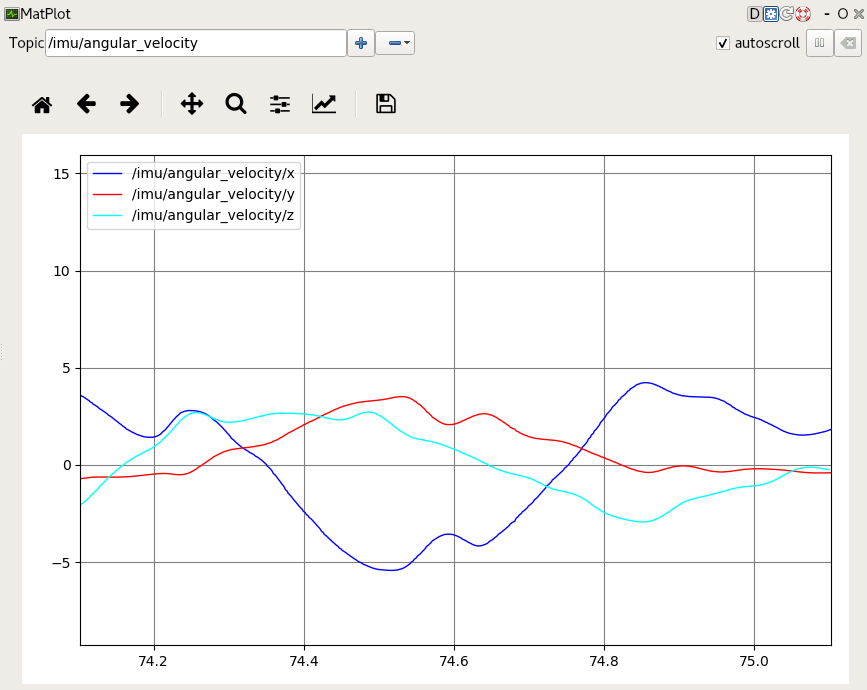

############################
Robot Operating System (ROS)
############################

Overview
========
The OpenZen ROS driver is hosted in a separate `git repository <https://bitbucket.org/lpresearch/openzenros/>`_. In provides
the ROS package to readout OpenZen sensors and provide IMU and magnetometer measurements via ROS topics.

Compilation
-----------

To compile this driver in your ROS setup, follow these steps:

.. code-block:: bash

    mkdir -p catskin_ws/src
    cd catskin_ws/src

    git clone --recurse-submodules https://bitbucket.org/lpresearch/openzenros.git

    # get your ROS environment going
    source /opt/ros/melodic/setup.bash
    catkin_make
    source ./devel/setup.bash

Running the Driver
------------------

Open another terminal window and run the ROS core:

.. code-block:: bash

    source /opt/ros/melodic/setup.bash
    roscore

You can then run the OpenZen ROS driver with this command in the window
you used to compile the software:

.. code-block:: bash

    rosrun openzen_sensor openzen_sensor

By default, it will connect to the first available sensor. If you want to connect to
a specific sensor, you can use the serial name of the sensor as parameter, for example:

.. code-block:: bash

    rosrun openzen_sensor openzen_sensor _sensor_name:="LPMSCU2000573"

Now you can print the IMU values from ROS with:

.. code-block:: bash

    rostopic echo /imu

Or plot some values (for example linear acceleration) with 

.. code-block:: bash

    rosrun rqt_plot rqt_plot "/imu/linear_acceleration/"

If you want to readout the values of two OpenZen sensors simultanously, you need to rename the topics and the node names likes this:

.. code-block:: bash

    rosrun openzen_sensor openzen_sensor __name:="cu2node" _sensor_name:="LPMSCU2000573" imu:=/cu2_imu mag:=/cu2_mag/
    rosrun openzen_sensor openzen_sensor __name:="ig1_node" _sensor_name:="LPMSIG1000032" imu:=/ig1_imu mag:=/ig1_mag/

You can also select another IO interface, for example Bluetooth:

.. code-block:: bash

    rosrun openzen_sensor openzen_sensor _sensor_interface:="Bluetooth" _sensor_name:="00:11:22:33:FF:EE"
