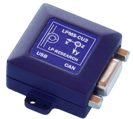
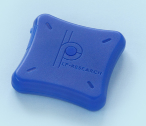
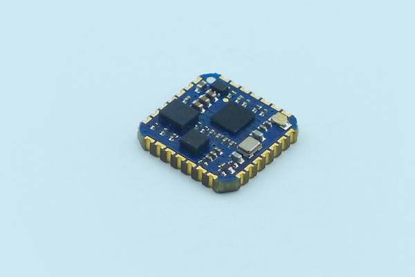
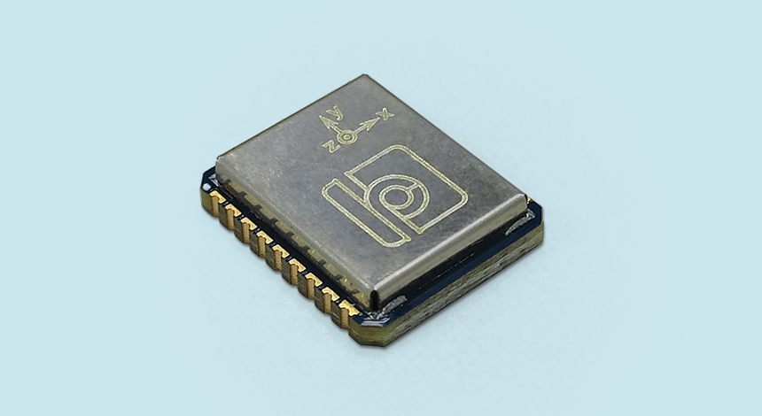

.. _supported-sensors-label:

#################
Supported Sensors
#################

LP-Research LPMS-CU2
====================

`Product Link <https://lp-research.com/9-axis-usb-and-can-bus-imu/>`__

9-Axis Inertial Measurement Unit (IMU) / attitude and heading reference system with CAN and
USB Connectivity. This sensor has one Imu component which can be accessed via OpenZen.

The LPMS-CU2 can be connected via a USB-cable and via the USB Express mode or the
COM-Port communication mode, depending on how the sensor is configured.

**Provided OpenZen component:**

1x IMU

LP-Research LPMS-B2
===================

`Product Link <https://lp-research.com/9-axis-bluetooth-imu/>`__

9-Axis Inertial Measurement Unit (IMU) / attitude and heading reference system with Bluetooth
Classic and Bluetooth low-energy Connectivity. This sensor has one Imu component which can be accessed via OpenZen.

The LPMS-B2 can be connected either via the Bluetooth or the Bluetooth Low-Energy subsystem of OpenZen.
To be able to connect to the sensor you must first pair it to your host system via your operating
system's bluetooth configuration.

The pairing process is described
`here <http://www.lp-research.com/wp-content/uploads/2016/09/LpmsB2QuickStartGuide20160727.pdf>`__

**Provided OpenZen component:**

1x IMU

LP-Research LPMS-IG1 and LPMS-IG1P
==================================
.. image:: images/lpms-ig1.jpg
   :alt: LP-Research LPMS-IG1 sensor

`Product Link LPMS-IG1 <https://lp-research.com/high-precision-9-axis-imu/>`__

`Product Link LPMS-IG1P <https://lp-research.com/9-axis-imu-with-gps-receiver/>`__

Ultra Low-Noise 9-Axis Inertial Measurement Unit (IMU) / attitude and heading reference system
with USB / CAN / RS232 Connectivity. The LPMS-IG1P has an Global Navigation Satellite System (GNSS) receiver.

The LPMS-IG1 sensor has one Imu component which can be accessed via OpenZen. The LPMS-IG1P sensor has
an additional GNSS component which is available to OpenZen.

**LPMS-IG1 provides OpenZen component:**

1x IMU

**LPMS-IG1P provides OpenZen components:**

1x IMU

1X GNSS

LP-Research LPMS-ME1
==================================

`Product Link LPMS-ME1 <https://lp-research.com/lpms-me1/>`__

LPMS-ME1 is a high performance miniature inertial measurement unit (IMU) with multiple communication interfaces.
Integrating UART, i2c and SPI in the same unit LPMS-ME1 perfectly fits both machine and human motion measurements
for size and cost sensitive applications.

OpenZen can communicate via UART directly with the LPMS-ME1 or via a SiLabs Serial-To-USB conversion
chip. The LPMS-ME1 development kit contains such a SiLabs chip to connect the LPMS-ME1 to a PC.

**Important Note: The default UART baudrate of the LPMS-ME1 is 115200 baud. OpenZen uses a larger baudrate by default 
so 115200 baud needs to be selected when connecting with OpenZen to an LPMS-ME1 IMU.**

**LPMS-ME1 provides OpenZen component:**

1x IMU

LP-Research LPMS-BE1
==================================

`Product Link LPMS-BE1 <http://www.alubi.cn/lpms-be1/>`__

LPMS-BE1 is a high performance miniature inertial measurement unit (IMU) with multiple communication interfaces.
Integrating UART, i2c and SPI in the same unit LPMS-BE1 perfectly fits both machine and human motion measurements
for size and cost sensitive applications.

OpenZen can communicate via UART directly with the LPMS-BE1 or via a SiLabs Serial-To-USB conversion
chip. The LPMS-BE1 development kit contains such a SiLabs chip to connect the LPMS-BE1 to a PC.

**Important Note: The default UART baudrate of the LPMS-BE1 is 115200 baud. OpenZen uses a larger baudrate by default 
so 115200 baud needs to be selected when connecting with OpenZen to an LPMS-BE1 IMU.**

**LPMS-BE1 provides OpenZen component:**

1x IMU
