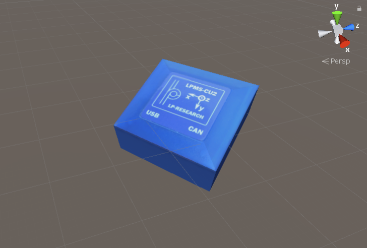

############
Unity Plugin
############

Overview
========
The OpenZen Unity plugin is hosted in a separate `git repository <https://bitbucket.org/lpresearch/openzenunity/src/master/>`_.
The repository contains a Unity project which demonstrates the sensor discovery in the file
``OpenZenDiscoverAndMove.cs``. Furthermore, the code in file ``OpenZenMoveObject.cs`` connects to a dedicated sensor
and applies its orientation to a Game Object in Unity.

